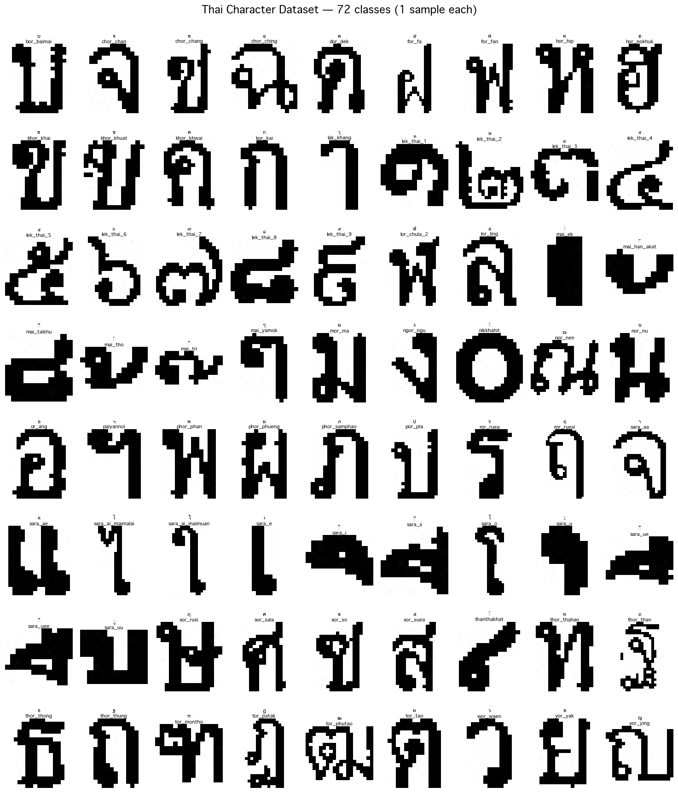
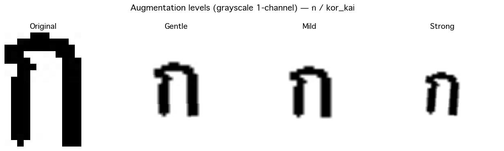

# 🔤 Thai Character Recognition — Transfer Learning

Classifying **72 classes of Thai handwritten characters, digits, and tone marks** from images,
using **Transfer Learning**. The project benchmarks three CNN architectures head-to-head:
**ResNet50**, **EfficientNet-B3**, and **MobileNetV3-Large**.

Thai OCR carries challenges that Latin scripts don't: vowels and tone marks can stack in
multiple layers (above, middle, and below a consonant), and several character pairs look nearly
identical (e.g. ฒ / ฐ / ถ). That makes it a genuinely harder image-classification problem than
typical Latin-character recognition — and a good testbed for comparing how different
transfer-learning backbones cope.

Inputs are **grayscale (1-channel)** — Thai characters don't depend on color. Each ImageNet-pretrained
model has its first conv layer patched to accept 1 channel and its classifier head replaced with
a 72-class output.

> 🧑‍🤝‍🧑 **This was a team project.** See [My Contributions](#-my-contributions) for an honest
> description of my personal role.

---

## ✨ Key Features

- **72-class** Thai character / digit / tone-mark classifier
- **3-architecture benchmark**: ResNet50 vs. EfficientNet-B3 vs. MobileNetV3-Large
- **Grayscale-adapted transfer learning** — first conv layer patched to 1 channel
- **3-level data augmentation** (gentle / mild / strong) to handle class imbalance
- **Stratified 80/10/10 split** with a fixed seed → reproducible, every class in every split
- **Robust training loop** — best-checkpoint saving, early stopping, `ReduceLROnPlateau`
- **CLI + notebook workflow** — train, evaluate, and run single-image inference either way
- Runs on **CUDA, Apple MPS, or CPU** (auto-detected)

## 🛠 Tech Stack

| Area | Tools |
|---|---|
| Deep learning | PyTorch, torchvision (pretrained CNNs) |
| Metrics | scikit-learn (accuracy, macro-F1, classification report) |
| Data / images | Pillow, NumPy |
| Visualization | matplotlib, seaborn |
| Utilities | tqdm |

## 📁 Project Structure

```
.
├── Thai-Character-Recognition.ipynb   # notebook orchestrator (calls into src/)
├── class_mapping.json                 # folder name ↔ Thai character (72 classes)
├── requirements.txt
├── src/
│   ├── dataset.py     # transforms, stratified split, ThaiCharDataset
│   ├── model.py       # create_model() factory, get_device()
│   ├── train.py       # training loop, evaluation, CLI entrypoint
│   └── predict.py     # single-image inference + CLI
├── make_assets.py     # regenerates the README preview images from the dataset
├── fill_results.py    # fills the results table below from results_summary.json
├── assets/            # small preview images (committed)
├── <class_name>/      # per-class image folders (gitignored, prepared locally)
└── outputs_<model>/   # training artifacts & weights (gitignored)
```

## 🧠 How It Works

<p align="center">
  
  <br>
  <em>The 72 classes — one real sample each (grayscale characters, digits, and tone marks).</em>
</p>

**1. Dataset** — Images are organized as `<class_name>/<image>.jpg`, where each `<class_name>`
maps to a Thai character in `class_mapping.json`. `src/dataset.py` reads **only** the 72 folders
listed in the mapping, so it never accidentally scans `src/` or output directories. Supported
extensions: `.jpg .jpeg .png .bmp .gif`.

**2. Stratified split** — Data is split **80/10/10 train/val/test, per class, with seed 42**, so every
class is represented in every split and results are reproducible. Classes with very few images are
guaranteed at least one training example.

**3. Augmentation** — Three escalating augmentation levels expand the training data and improve
robustness to real handwriting variation:

<p align="center">
  
  <br>
  <em>Gentle → mild → strong augmentation (rotation, affine, perspective, blur) on a grayscale input.</em>
</p>

- `single` (default) — one randomly chosen augmentation level per image (fast)
- `triple` — all three levels applied, tripling the effective dataset size

**4. Transfer learning** — Each backbone (ResNet50 / EfficientNet-B3 / MobileNetV3-Large) is loaded
with ImageNet weights, has its first conv layer rebuilt for 1-channel input, and its classifier head
replaced with a 72-class linear layer. Training uses Adam (`lr=1e-3`), cross-entropy loss, best-model
checkpointing on validation accuracy, early stopping on validation loss, and `ReduceLROnPlateau`.

**5. Evaluation** — The best checkpoint is scored on the held-out test set for accuracy and macro-F1,
with a full per-class classification report and confusion matrix.

## 📊 Results (Test Set)

> Trained for up to 10 epochs, `augment=single`, batch=32, Adam `lr=1e-3`,
> early stopping (patience 4) + `ReduceLROnPlateau`, on Apple MPS.
> Numbers come from the team's actual training runs (`results_summary.json`).

<!-- RESULTS_TABLE -->
| Model | Test Accuracy | Macro F1 | Best Val Acc | Epochs |
|---|---|---|---|---|
| ResNet50 | 97.79% | 0.9780 | 98.23% | 10 |
| EfficientNet-B3 | 97.63% | 0.9592 | 97.96% | 10 |
| MobileNetV3-Large | 96.59% | 0.9238 | 97.11% | 10 |
<!-- /RESULTS_TABLE -->

### Sample Predictions

<!-- TODO: add a screenshot of single-image predictions here, e.g. assets/sample_predictions.png -->
> 📷 _Sample-prediction screenshot placeholder — run `src.predict` on a few test images and drop the
> output image here._

## ⚙️ Setup

```bash
pip install -r requirements.txt
```

Versions are pinned to the training environment (Apple Silicon / MPS). On a CUDA machine, install the
matching `torch` / `torchvision` build from https://pytorch.org instead of the pinned versions.

> **Dataset note:** the per-class image folders are **not** included in the repo (they're large and
> gitignored). Arrange images locally as `<class_name>/<image>.jpg` matching the keys in
> `class_mapping.json` before training.

## 🚀 Train

```bash
# Train all three models (up to 10 epochs, early stopping + ReduceLROnPlateau)
python -m src.train --models all --epochs 10 --augment single

# Train a single model
python -m src.train --models efficientnet_b3 --epochs 15

# Quick smoke test (cap images per class)
python -m src.train --models mobilenet_v3 --epochs 1 --max-per-class 20
```

Artifacts are saved to `outputs_<model>/` (`*_best.pt`, `training_history.json`,
`classification_report_*.json`) with a combined `results_summary.json`.

## 🔮 Predict a Single Image

```bash
python -m src.predict path/to/image.jpg --model efficientnet_b3
```

Or in Python / a notebook:

```python
from src.predict import test_single_image
res = test_single_image("kor_kai/0001.jpg", model_name="efficientnet_b3", topk=3)
print(res["predicted_char"], res["confidence"])
```

## 🙋 My Contributions

This was a **team project**. My personal contribution was **dataset preparation and labeling**:

- The source images arrived in folders named only by number (161–249) with **no mapping** to actual
  Thai characters. I **inspected the images by hand and assigned the correct Thai character label** to
  each of the **72 classes**, producing the `class_mapping.json` used throughout the pipeline.
- Organized the images into the per-class folder structure the data loader expects
  (`<class_name>/<image>.jpg`).
- Flagged **data-quality issues** for the team: near-identical character pairs that are easy to
  mislabel (e.g. ฒ / ฐ / ถ) and **severely under-represented classes** (some with only 1–4 images),
  which directly informed the stratified-split and augmentation strategy.

The model architectures, training loop, and evaluation code were built by other team members.

## 📝 Notes

- Some classes have very few images; predictions for those are less reliable by design.
- A handful of the 72 labels were assigned by visual inspection and should be spot-checked before any
  production use.
- Training on MPS (no CUDA) is slow — ResNet50 takes roughly 16 minutes per epoch.
